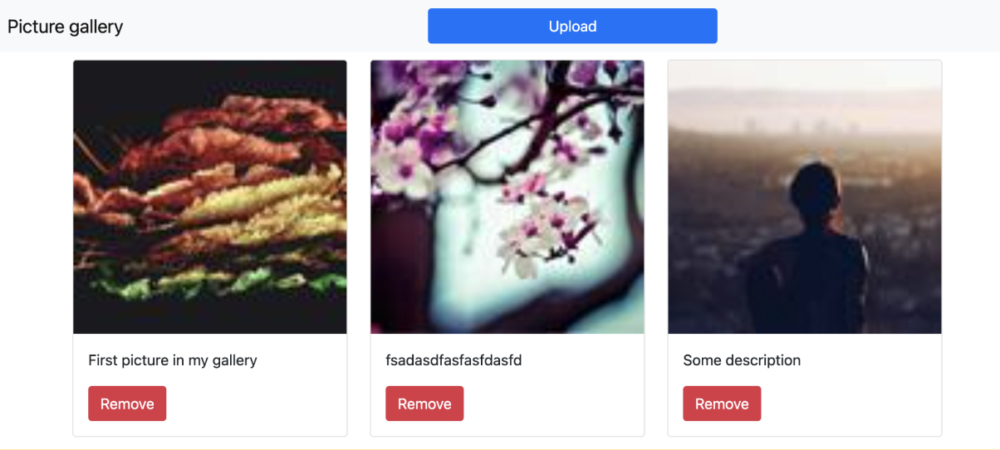

Практика
===========

## Модуль 19. Асинхронность и message driven архитектура

В этом модуле вы:
1. узнали, что протокол HTTP синхронен, и разобрались, какие ограничения это накладывает на его использование;
2. изучили, какие есть альтернативы протоколу HTTP, когда взаимодействие между частями системы принципиально асинхронно;
3. познакомились с основными понятиями архитектуры, управляемой сообщениями (message driven);
4. опробовали на практике типичные и часто используемые брокеры сообщений, такие как ActiveMQ, RabbitMQ, Kafka.

## Цели практической работы

Закрепить полученные знания через решение реальной задачи.
Оценить на практике проблему, которая возникает при использовании синхронного протокола HTTP, и исправить её с помощью message driven архитектуры.
Что нужно сделать
Дано приложение-фотогалерея, в которое пользователь может загружать изображения, нажав на кнопку Upload. Скриншот главной страницы этого приложения:

Изображения в галерее получены с помощью сервиса [генерации случайных картинок](https://picsum.photos/100/100?random=1).
После загрузки файл изображения сохраняется в заданную директорию на диске (её нужно указать в параметре `path.to.pictures` файла `application.properties` в модуле `photo-gallery-app`).

Чтобы загруженное изображение отобразилось в браузере, нужно также добавить запись о нём в таблицу pictures.

Предположим, что после загрузки изображение должно пройти обработку, которая может занять длительное время. Эту обработку мы имитируем в методе `processPicture()` класса `PictureServiceImpl` с помощью метода delay.

1. Запустите приложение и попробуйте загрузить картинку в галерею. Вы увидите, что браузер будет длительное время ожидать ответа.
2. Посмотрите на метод `uploadPicture` в контроллере `GalleryController`. Проблема с длительным ожиданием ответа при загрузке изображения возникает из-за того, что выполнение метода `processPicture()` занимает много время.
3. Решите эту проблему, сделав обработку загруженного изображения асинхронной. После сохранения изображения методом `pictureService.uploadPicture()` не должен вызываться метод `processPicture()`, а должно отправляться сообщение в очередь какого-либо брокера сообщений.
4. В модуле `photo-gallery-common` уже подключён стартер для RabbitMQ, но вы по желанию можете использовать ActiveMQ или Kafka.
5. Создайте класс конфигурации брокера в модуле `photo-gallery-common`.
6. Для ActiveMQ и Kafka не забудьте в модулях `photo-gallery-app` и `photo-gallery-picture-processor` добавить параметры подключения в файлы `application.properties` этих приложений.
7. После этого добавьте отправку сообщения о загрузке в контроллер, как сказано в пункте 2
8. Добавьте обработку отправленного сообщения в приложение `photo-gallery-picture-processor`. Обработчик сообщения в этом приложении должен вызывать метод `pictureService.processPicture()`. Обратите внимание, что оба приложения должны подключаться к одной и той же базе данных MySQL.
9. Установите и запустите приложение-брокер сообщений.
10. Запустите оба приложения: `photo-gallery-app` и `photo-gallery-picture-processor`. Попробуйте снова загрузить изображение в галерею и сравните, как приложение работает теперь, с тем, как оно работало вначале.

## Что оценивается

1. В модуле `photo-gallery-common` создана конфигурация для используемого брокера сообщений. 
   * Для ActiveMQ она должна содержать настройки для сериализации сообщений в JSON и обратно. 
   * Для RabbitMQ, помимо сериализации, нужно создать одну очередь и точку обмена типа direct. 
   * Для Kafka — только очередь.

2. В модуль `photo-gallery-app` добавлена отправка сообщения о том, что новое изображение загружено и ждёт обработки. Отправка сделана с помощью messageTemplate-сервиса используемого брокера.
3. В модуле `photo-gallery-picture-processor` настроен слушатель (Listener), принимающий сообщения о том, что картинка загружена и ждёт обработки.
4. Приложение собирается, запускается и работает ожидаемым образом. После загрузки очередного изображения асинхронно запускается процесс его обработки. Приложение работает даже после запуска нескольких экземпляров приложения `photo-gallery-picture-processor`.

Как отправить работу на проверку
Пришлите ссылку на решение через форму ниже.

